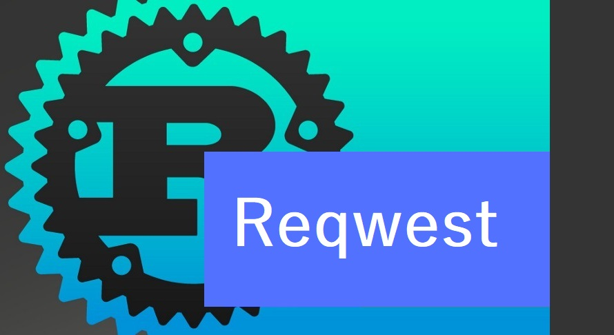

# Acessando requisições Rest - reqwest

## Se inscreva no meu canal no 💛[Youtube](https://youtu.be/obU_J7q1khI)  

Vídeos sobre Rust 🦀

Esta é a continuação do vídeo [reqwest block](https://www.youtube.com/watch?v=obU_J7q1khI) agora com async unsando a crate tokio
[Vídeo novo](https://www.youtube.com/watch?v=_JROpEQ6RFs)

